# Session1: Creating an app

## create the meeting app

```
$ bench new-app meeting
INFO:bench.app:creating new app meeting
App Title (default: Meeting): 
App Description: Prepare agenda, invite users and record minutes of a meeting
App Publisher: frappe
App Email: frappe@example.com
App Icon (default 'octicon octicon-file-directory'):
App Color (default 'grey'):
App License (default 'MIT'): 
'meeting' created at /home/frappe/frappe-bench/apps/meeting
```

## install the app to the default site

```
$ cat sites/currentsite.txt 
site1.local

$ bench --site site1.local install-app meeting
```

## enable developer mode
```
$ bench --site site1.local set-config developer_mode 1
```

## start the server
```
$ bench start
```

## access the page
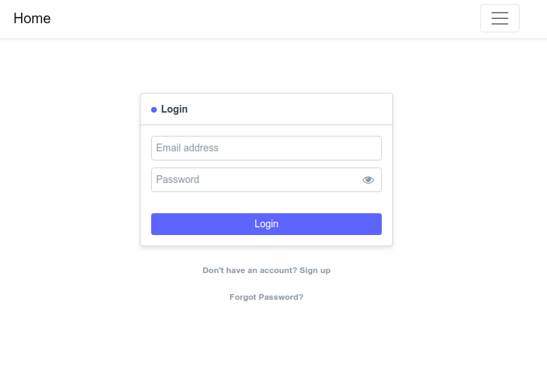

# Session 2: Making DocTypes 1

## DocTypes

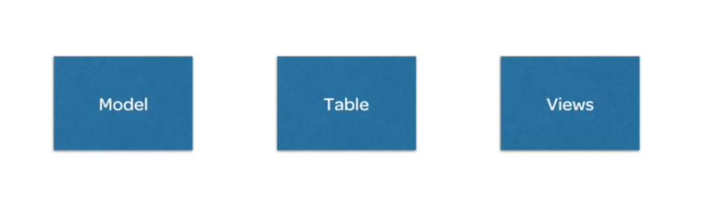

- everything is a DocType (MVC)
- represents a table in a database
- represents a view

## DocFields

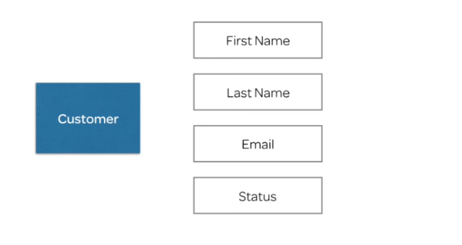

- fields in the database

## Links
- are foreign keys
- extract data from another DocType

## Doc Perms
- permission for a DocType
- user can have multiple roles

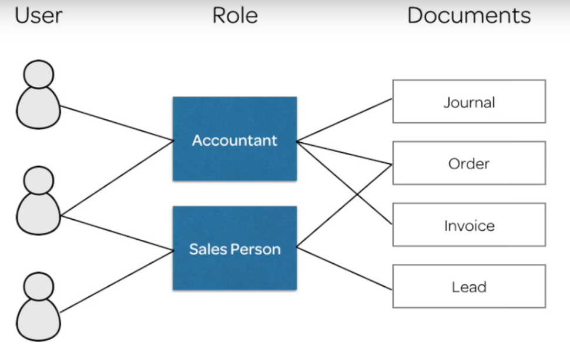


## Child Tables
- form inside a form
- parent child

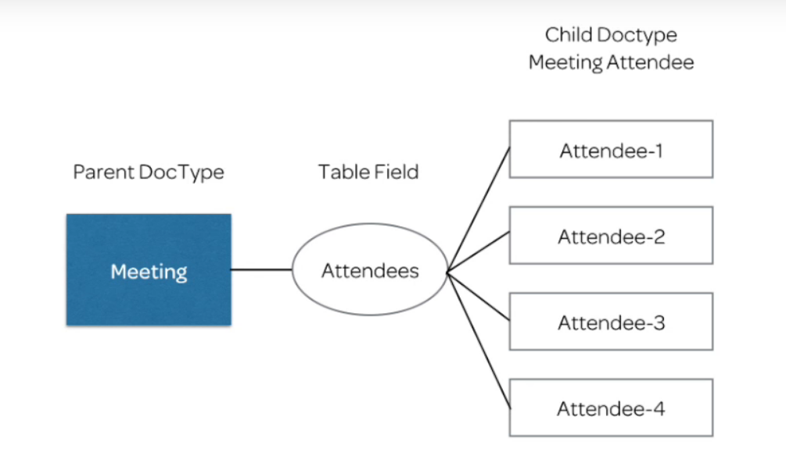


# create a meeting app

## create a new Module 
- Meeting module

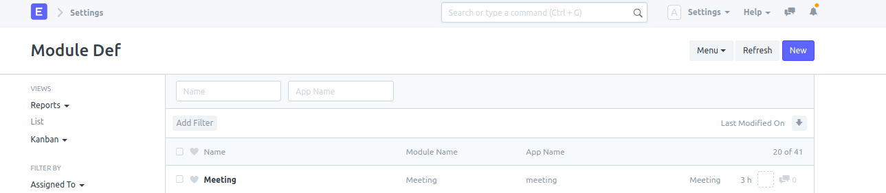

## create a new Role
- Meeting Manager

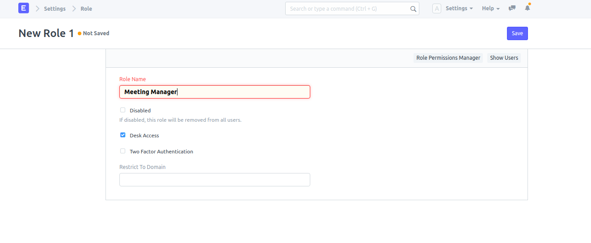

## create a doctype
- Meeting DocType

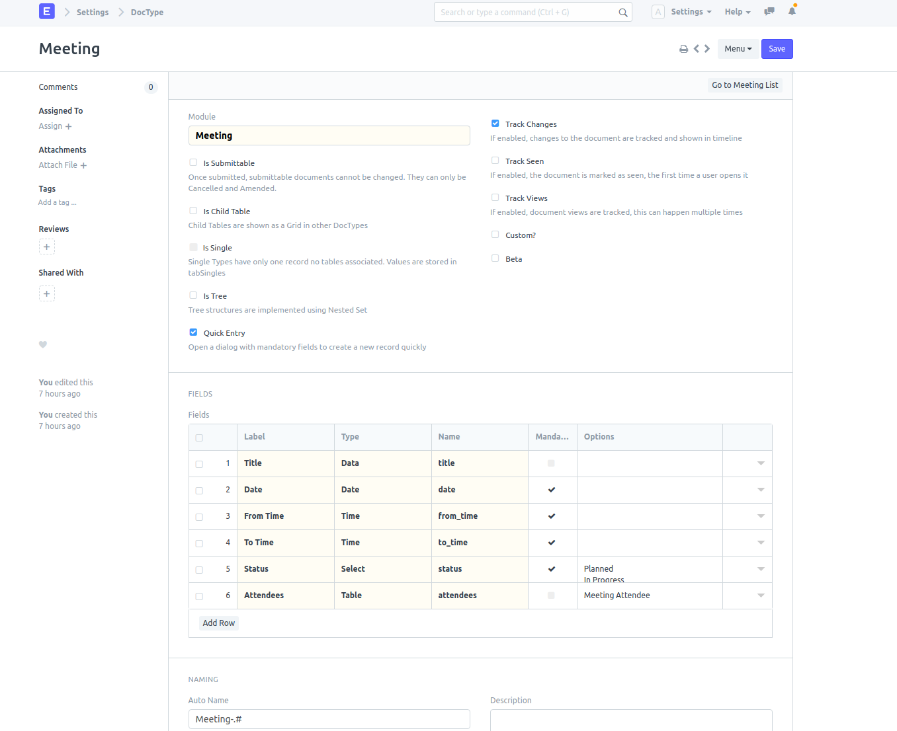

## create a child doctype

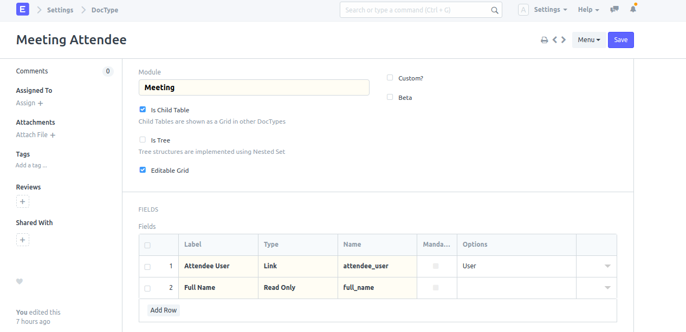

### in List View the column will be displayed in list view

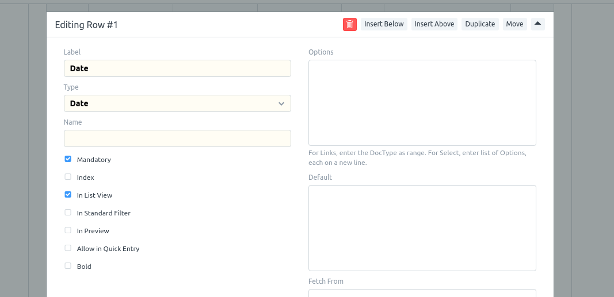

### Select will display Drop Down value

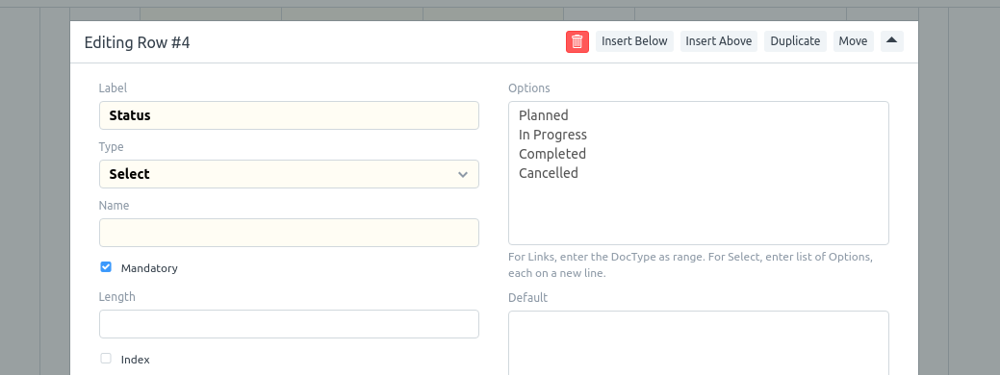

### Numbering meetings
- Like Meeting-1, Meeting-2

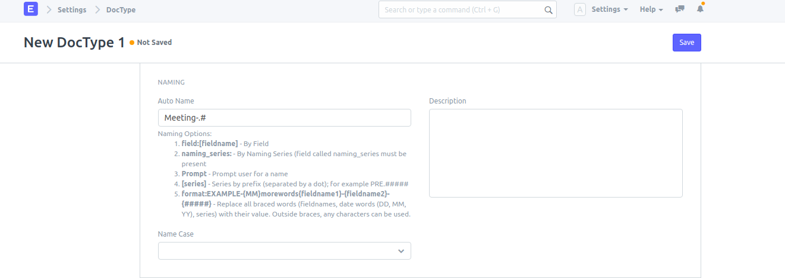

# Session 4: Scripting DocTypes 1

## Scripting

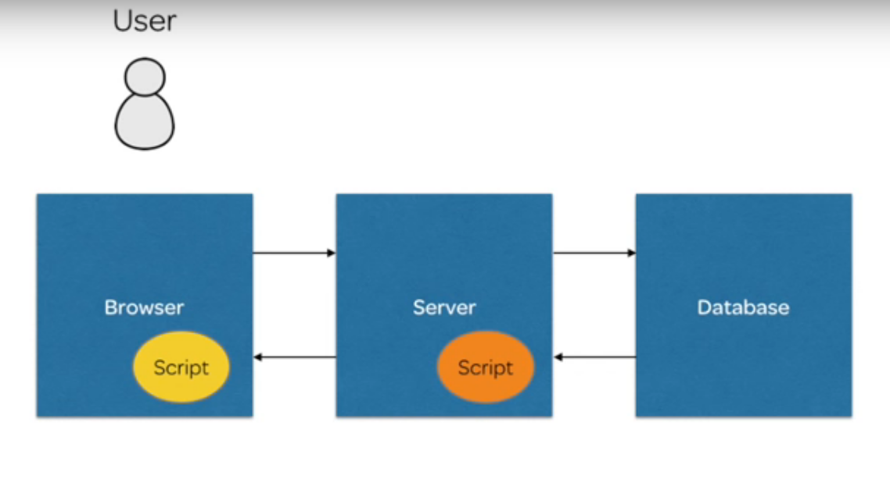
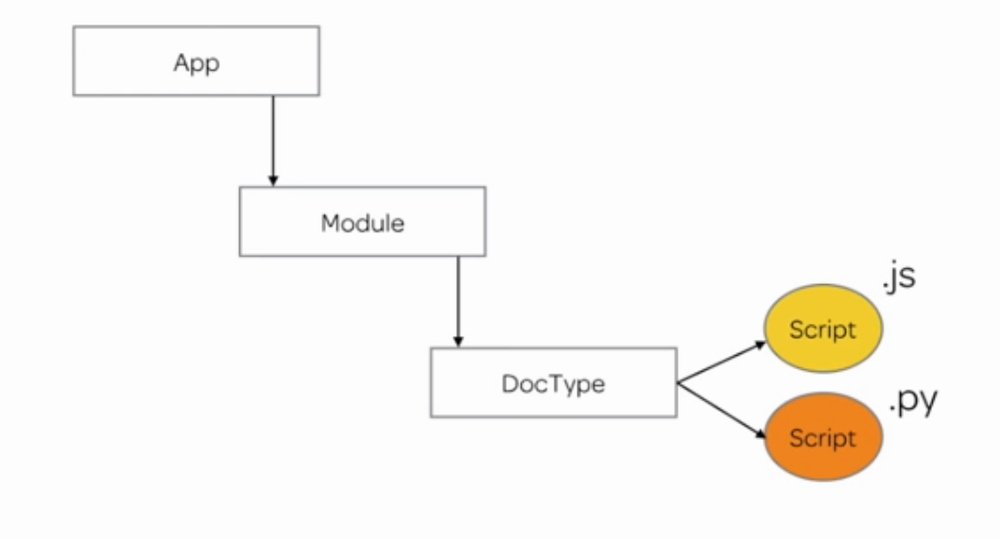

## Controllers
- methods that can be used in scripting

1. before_insert
2. validate (before inserting or updating)
3. on_update (after saving)
4. on_submit (when document is set as submitted)
5. on_cancel
6. on_trash (before it is about to be deleted)

## full name is not appearing in the saved meeting

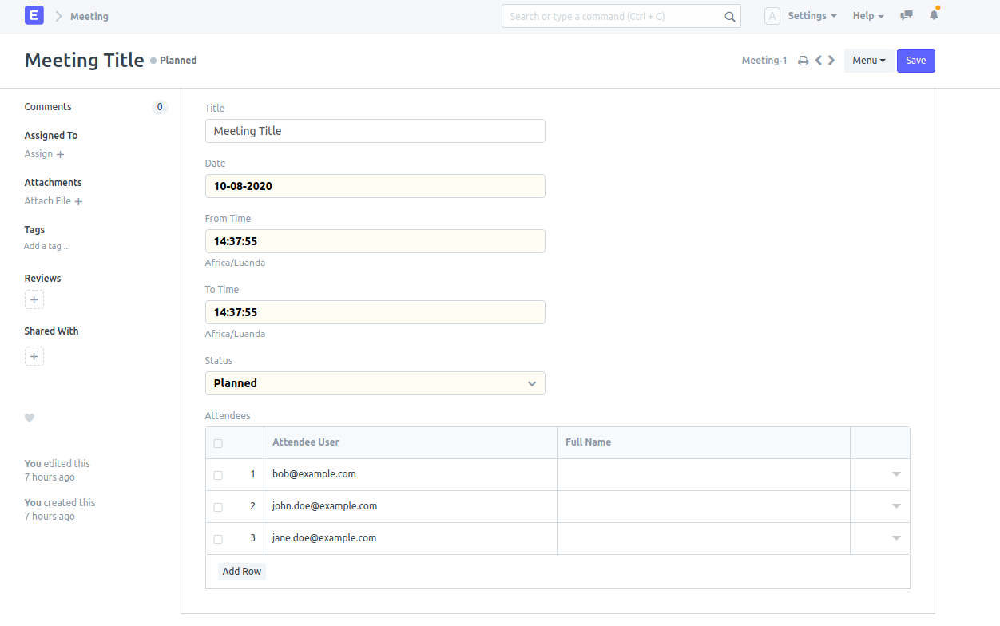

## use console

```
$ bench --site site1.local console

In [1]: import frappe

In [2]: frappe.get_doc("User", "bob@example.com")
Out[2]: <frappe.core.doctype.user.user.User at 0x7faff4391320>

In [3]: user = frappe.get_doc("User", "bob@example.com")

In [4]: user.full_name
Out[4]: 'bob doe'

In [5]: 
```

## modify meeting.py
```py
class Meeting(Document):
    def validate(self):
        for attendee in self.attendees:
            if attendee.full_name is None:
                # frappe.get_doc("User", "bob@example.com")
                user = frappe.get_doc("User", attendee.attendee_user)
                attendee.full_name = user.full_name
```

## full name will appear after meeting is saved

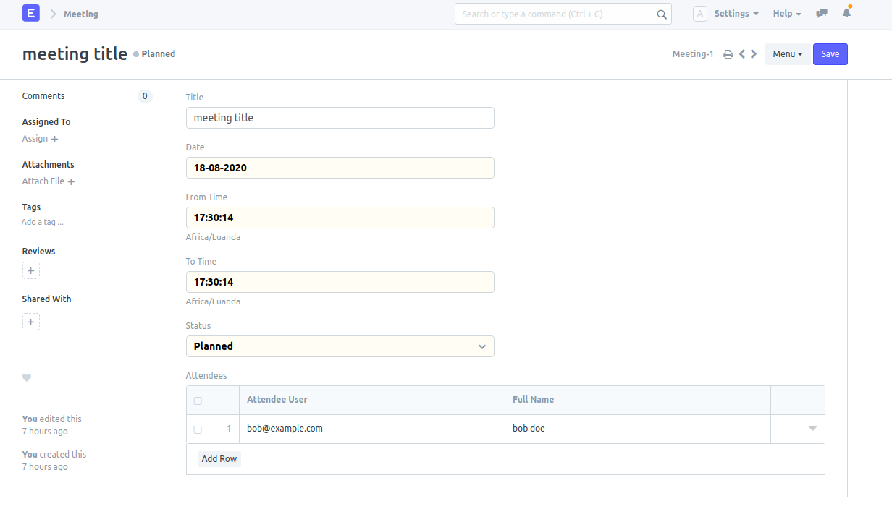

## Clint-side Scripting

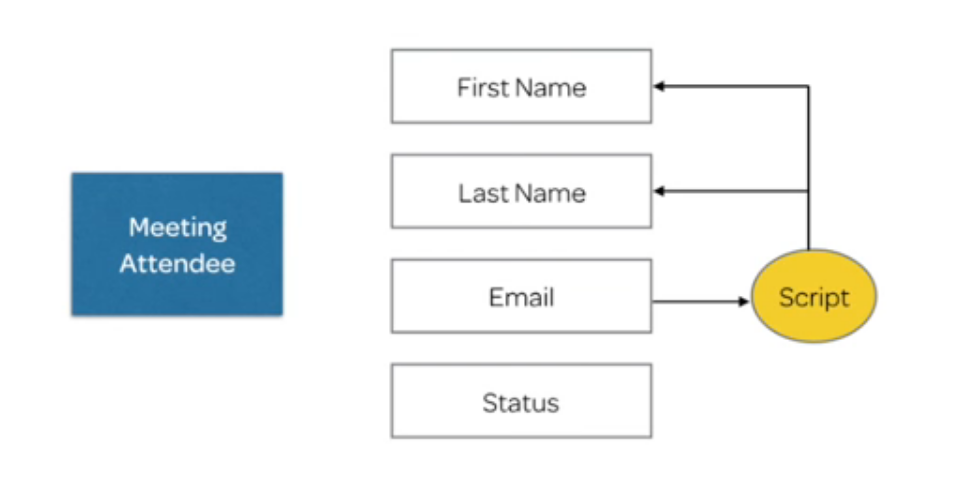

## frappe.call
- frontend get data from backend

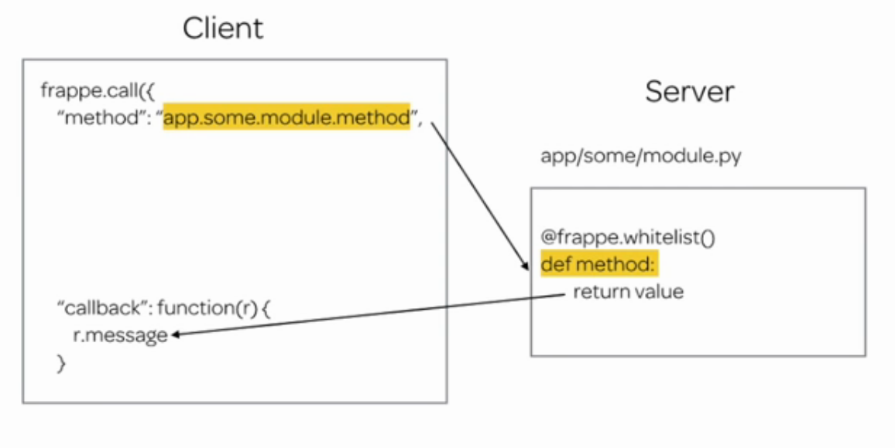

## insert the full name before saving the meeting

### modify meeting.py
```py
class Meeting(Document):
    def validate(self):
        for attendee in self.attendees:
            if attendee.full_name is None:
                attendee.full_name = get_full_name(attendee.attendee_user)

@frappe.whitelist()
def get_full_name(attendee):
    user = frappe.get_doc("User", attendee)
    return user.full_name
```

### modify meeting.js
```js
frappe.ui.form.on("Meeting Attendee", {
        attendee_user: function(frm, cdt, cdn) {
                var attendee = frappe.model.get_doc(cdt, cdn);
                if (attendee.attendee_user) {
                        // if attendee, get full name
                        frappe.call({
                                method: "meeting.meeting.doctype.meeting.meeting.get_full_name",
                                args: {
                                        attendee: attendee.attendee_user
                                },
                                callback: function(r) {
                                        frappe.model.set_value(cdt, cdn, "full_name", r.message);
                                }
                        });

                } else {
                        // if no attendee, clear full name
                        frappe.model.set_value(cdt, cdn, "full_name", null);
                }
        },
});
```

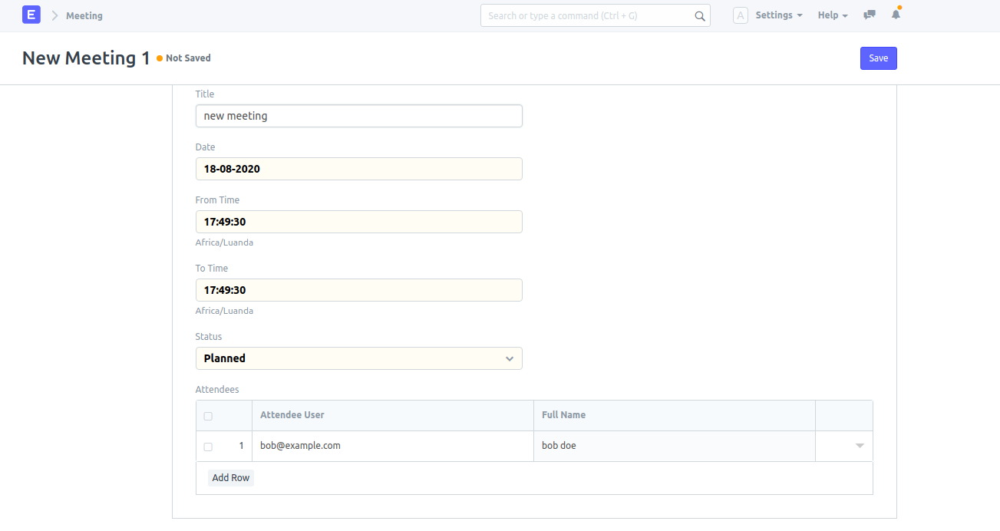


# Session 5: Scripting DocTypes 2

## send emails to attendees when status is set to Planned with Invitation Message

### create a button and text editor in meeting doctype

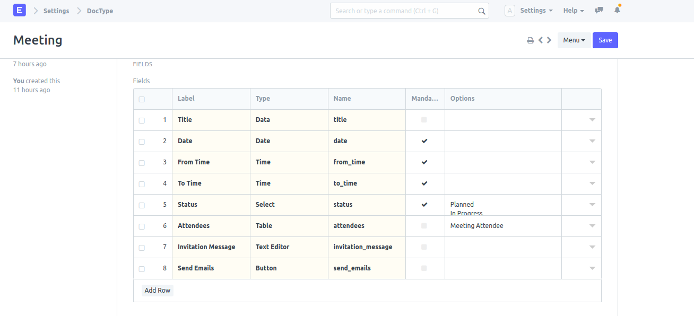

### add Invitation Sent status
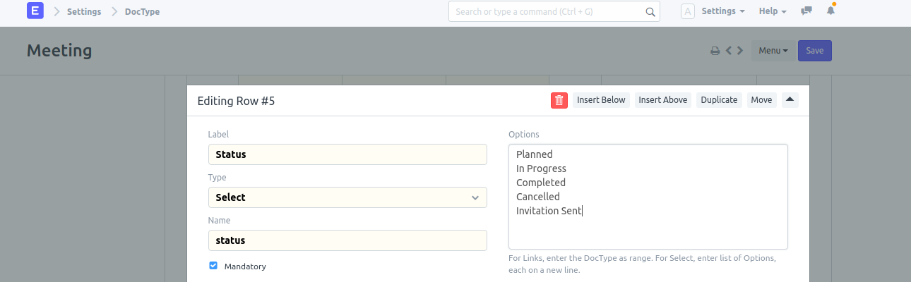

### modify meeting.js
```js
frappe.ui.form.on("Meeting", {
	send_emails: function(frm) {
		if (frm.doc.status==="Planned") {
			frappe.call({
				method: "meeting.api.send_invitation_emails",
				args: {
					meeting: frm.doc.name
				}
			});
		}
	},
});
```

### modify apps/meeting/meeting/api.py 
```py
import frappe
from frappe import _
from frappe.utils import nowdate, add_days

@frappe.whitelist()
def send_invitation_emails(meeting):
        meeting = frappe.get_doc("Meeting", meeting)
        meeting.check_permission("email")

        if meeting.status == "Planned":
            
            recipients=[d.attendee_user for d in meeting.attendees],
            sender=frappe.session.user,
            subject=meeting.title,
            message=meeting.invitation_message,
            reference_doctype=meeting.doctype,
            reference_name=meeting.name

            print(f'Emails being sent to {recipients} by {sender}')

            meeting.status = "Invitation Sent"
            meeting.save()

            frappe.msgprint(_("Invitation Sent"))

        else:
            frappe.msgprint(_("Meeting Status must be 'Planned'"))
```

### output
```
17:41:50 web.1            | Emails being sent to (['bob@example.com', 'pink@example.com'],) by ('Administrator',)
```

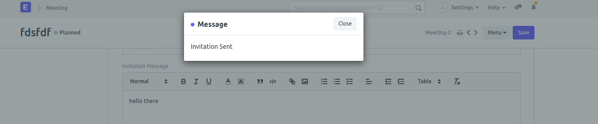

## show send emails button when status is Planned only

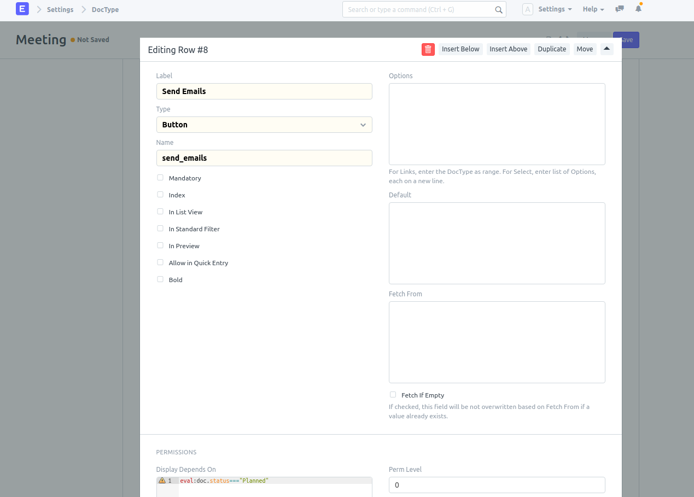


# Session 6: Views and Navigation

## Create calendar view for the meetings

### add meeting_calendar.js
```js
frappe.views.calendar["Meeting"] = {
        field_map: {
                "start": "start",
                "end": "end",
                "id": "name",
                "title": "title",
                "status": "status",
                "allDay": "all_day",
        },
        get_events_method: "meeting.api.get_meetings"
}
```

### modify apps/meeting/meeting/api.py
```py
@frappe.whitelist()
def get_meetings(start, end):
        if not frappe.has_permission("Meeting", "read"):
                raise frappe.PermissionError

        return frappe.db.sql("""select
                timestamp(`date`, from_time) as start,
                timestamp(`date`, to_time) as end,
                name,
                title,
                status,
                0 as all_day
        from `tabMeeting`
        where `date` between %(start)s and %(end)s""", {
                "start": start,
                "end": end
        }, as_dict=True)
```

# Session 7: Connecting using Hooks

## execute a function when new User is created

### modify apps/meeting/meeting/hooks.py
```py
doc_events = {
        "User": {
                "after_insert": "meeting.api.make_orientation_meeting"
        }
}
```

### modify apps/meeting/meeting/api.py
```py

def make_orientation_meeting(doc, method):
        """Create an orientation meeting when a new User is added"""
        meeting = frappe.get_doc({
                "doctype": "Meeting",
                "title": f"Orientation for {doc.first_name}",
                "date": add_days(nowdate(), 1),
                "from_time": "09:00",
                "to_time": "09:30",
                "status": "Planned",
                "attendees": [{
                        "attendee_user": doc.name
                }]
        })
        # the System Manager might not have permission to create a Meeting
        meeting.flags.ignore_permissions = True
        meeting.insert()

        frappe.msgprint(_("Orientation meeting created"))
```


## create a new user and a new meeting will be created
